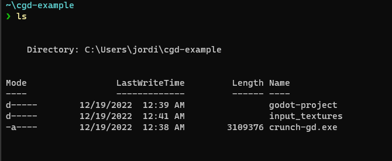
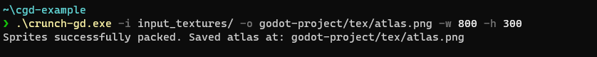
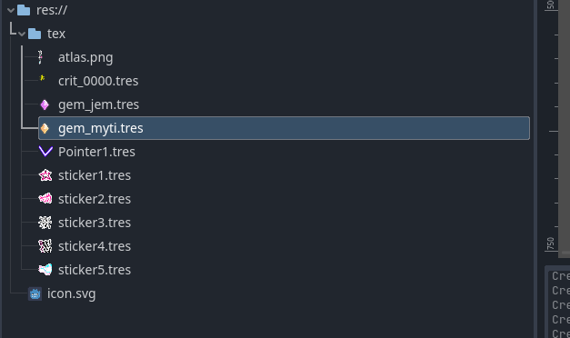
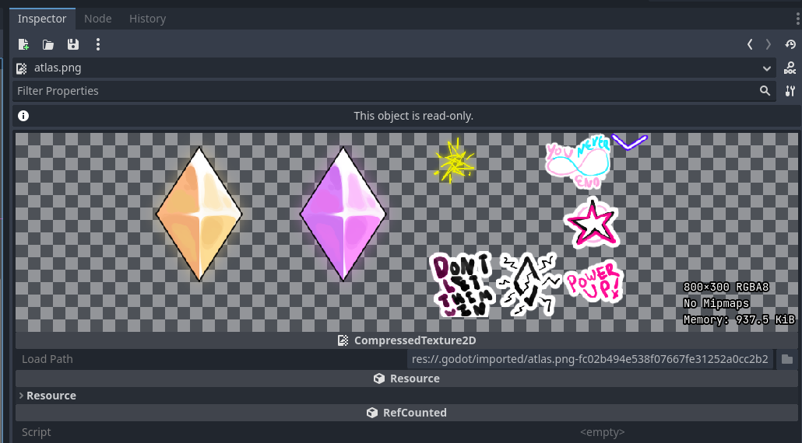
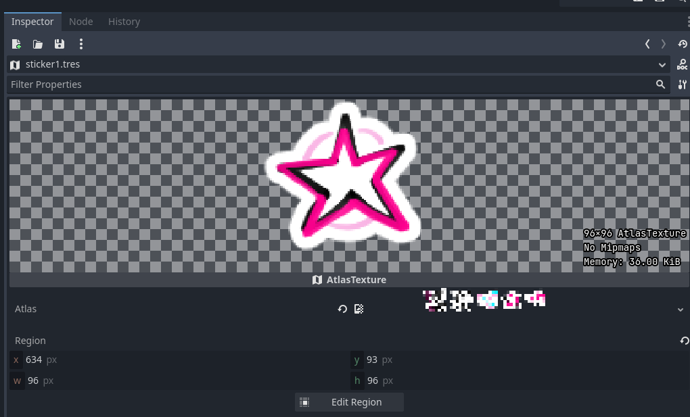
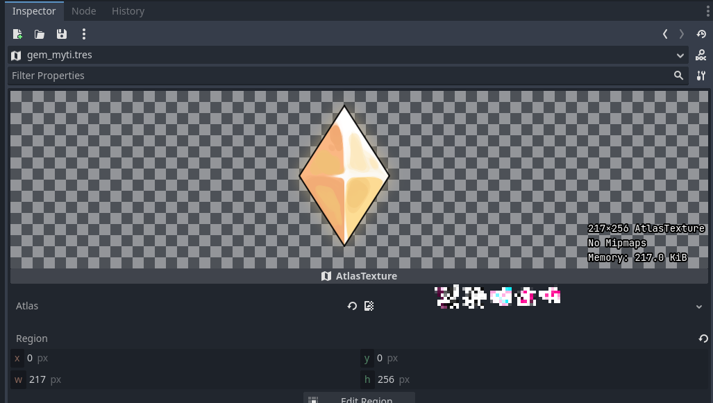

# crunch-gd
A CLI texture packer for Godot. Automatically creates AtlasTexture resources from generated spritesheet.

Uses ChevyRay's [crunch-rs](https://github.com/chevyray/crunch-rs/) for rect packing.

Targets 4.x by default. For Godot 3 support, use the `--gd3` flag.
## Usage:
```
> crunch-gd.exe -i input_textures/ -o godot-project/atlas.png
Sprites successfully packed. Saved atlas at: godot-project/atlas.png

> crunch-gd.exe --help
FLAGS:
        --gd3        Generate AtlasTexture resources for Godot 3.x intead of 4.0
        --watch      While running, regenerate atlas when input files changed.
        --help       Prints help information
    -V, --version    Prints version information

OPTIONS:
    -i, --input_path <input_path>        Location of all sprites to be packed
    -o, --output_path <output_path>      Path for resulting spritesheet to be exported. Value must be relative to
                                         project root, as all resources generated will point to it. [default:
                                         ./atlas.png]
    -w, --width <Spritesheet Width>      Final Width of Spritesheet [default: 512]
    -h, --height <Spritesheet Height>    Final Height of Spritesheet [default: 512]
    -p, --padding <Padding>              Amount of empty space to put between each sprite [default: 0]
```

## Example Results:







**For any assistance or questions, create an issue or DM me on Discord at `jordi ★#0317`**